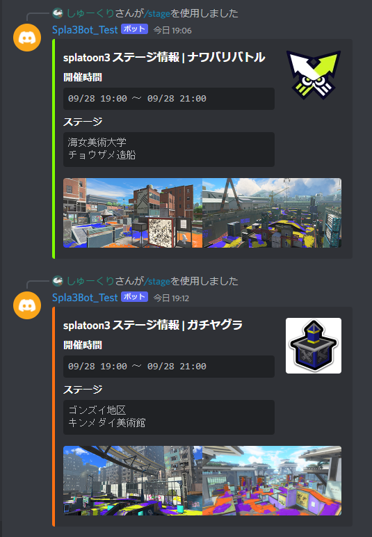
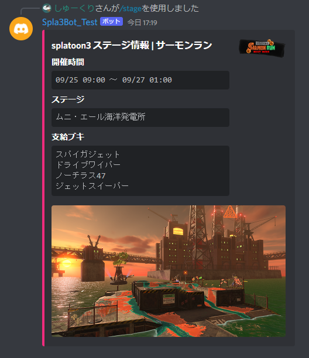
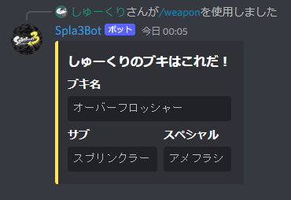
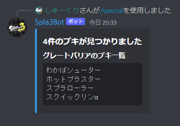

<div align="center"></div>

# Discord Bot for Splatoon 3
<p align="center">
  <a href="//github.com/syu-kuri/Spla3bot/releases"></a>
  <a href="//github.com/syu-kuri/Spla3bot/issues"></a>
  <a href="//github.com/syu-kuri/Spla3bot/releases"></a>
  <a href="//github.com/syu-kuri/Spla3bot/commits/main"></a>
  <a href="//github.com/syu-kuri/Spla3bot"></a>
</p>


This is a Discord Bot that returns Splatoon 3 stage information by Slash Command.

This bot uses the API of [Spla3 API](https://spla3.yuu26.com/) produced by Emuon to get information.

## Invite Discord server
[Click here to invite Spla3bot to your server](https://discord.com/api/oauth2/authorize?client_id=1020415520337576066&permissions=2147503104&scope=bot%20applications.commands)

## Reports and Requests
Please report bugs and requests for additional features to [Discord Server](https://discord.gg/zwbvUPTZHc) or to an issue in this repository.


## How to use the command
Sorry, I'm not sure. Finish mentions and normal commands support.

**Slash Command**
```
/commandName Optional[arguments]
```

## List of commands
### View stage information
* `stage [match] [timing]` ... Returns stage information for the selected rule and time.
  * **match** : select battle mode. regular | bankara-challenge | bankara-open | x
  * **timing** : select timing. now | next | schedule

* `coop [timing]` ... Returns stage information for the selected time.
  * **timing** : select timing. now | next | schedule

### Search weapon from sub weapon or special
* `sub [sub-weapon-name]` ... Returns a list of weapons matched from the selected sub weapon.
* `special [special-name]` ... Returns a list of weapons matched by the selected special.


## Example of command execution
<div align="center">
  
  
  
  
</div>

## Future Progress
* ~~Support for Salmon Run information after API support~~
* ~~Add random weapon selection~~
* ~~Add stage image~~
* ~~Get all stage information~~
* 4 vs. 4 teaming
