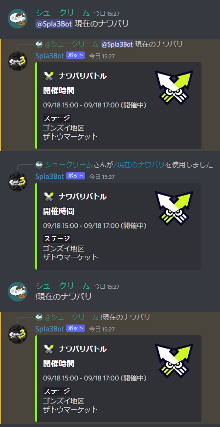

<div align="center"></div>

# Discord Bot for Splatoon 3

This is a Discord Bot that returns Splatoon 3 stage information by either Mention, Slash Command, or Command.

This bot uses the API of [Spla3 API](https://spla3.yuu26.com/) produced by Emuon to get information.

## How to use the command
**Mention**
```
@Spla3Bot 現在のナワバリ
```
**Slash Command**
```
/現在のナワバリ
```
**Command**
```
!次のナワバリ
```

## List of commands
### View current stage information
* `現在のナワバリ` ... Returns the current Navavari stage information.
* `現在のバンカラチャレンジ` ... Returns the stage information of the current challenge match
* `現在のバンカラオープン` ... Returns stage information for the current open match
### View next stage information by relative specification
* `次のナワバリ` ... Returns stage information for the next Navarari
* `次のバンカラチャレンジ` ... Returns stage information for the next challenge match
* `次のバンカラオープン` ... Returns stage information for the next open match
### View stage information for the next 24 hours from the current stage
* `すべてのナワバリ` ... Returns the stage information of the next Navarry for the next 24 hours
* `すべてのバンカラチャレンジ` ... Returns stage information for the next challenge match up to 24 hours in the future
* `すべてのバンカラオープン` ... Returns stage information for open matches up to 24 hours in the future

## Example of command execution
<div align="center"></div>

## Future Progress
* Search for specific rules
* Search for specific time
* Support for Salmon Run information after API support
* Support for shortened command search
