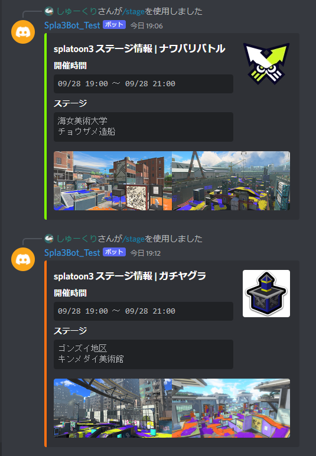
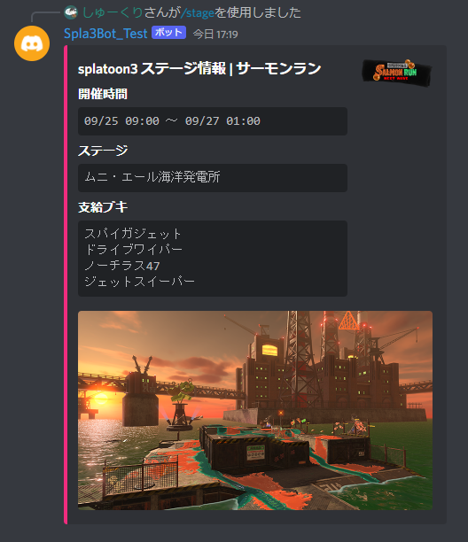
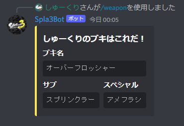
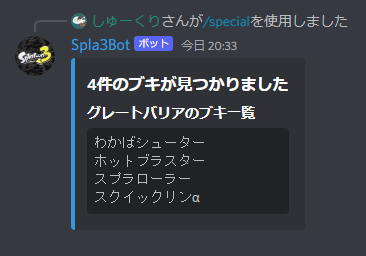

<div align="center"></div>

# Discord Bot for Splatoon 3

<p align="center">
  <a href="https://github.com/syu-kuri/Spla3bot/releases"></a>
  <a href="https://github.com/syu-kuri/Spla3bot/issues"></a>
  <a href="https://github.com/syu-kuri/Spla3bot/releases"></a>
  <a href="https://github.com/syu-kuri/Spla3bot/commits/master"></a>
  <a href="https://github.com/syu-kuri/Spla3bot"></a>
</p>

Spla3bot is a Discord bot that returns Splatoon 3 stage information with slash commands.

It uses [Spla3 API](https://spla3.yuu26.com/) produced by Emuon to get schedule information.

## Invite

[Click here to invite Spla3bot to your server](https://discord.com/api/oauth2/authorize?client_id=1020415520337576066&permissions=2147503104&scope=bot%20applications.commands)

## Commands

Slash commands:

```text
/commandName Optional[arguments]
```

| Command | Description |
| --- | --- |
| `/stage [rule] Optional[time]` | Returns stage information for the selected rule and time. |
| `/weapon` | Returns a random weapon. |
| `/sub [sub-weapon-name]` | Returns weapons matched by the selected sub weapon. |
| `/special [special-name]` | Returns weapons matched by the selected special weapon. |
| `/info` | Returns bot information. |
| `/help` | Returns command help. |


## Docker

Create `.env` from the example and set your Discord bot values.

```sh
cp .env.example .env
```

Environment variables:

| Name | Required | Description |
| --- | --- | --- |
| `token` | Yes | Discord bot token. |
| `prefix` | Yes | Prefix for owner-only text commands. |
| `error_ch` | Yes | Discord channel ID for error reports. |

Build and start the bot.

```sh
docker compose up -d --build
```

Show logs.

```sh
docker compose logs -f spla3bot
```

Stop the bot.

```sh
docker compose down
```


## Local Development

Install dependencies with uv.

```sh
uv sync
```

Run the bot.

```sh
uv run python main.py
```

## Examples

<div align="center">
  
  
  
  
</div>

## Reports and Requests

Please report bugs and requests for additional features to the [Discord server](https://discord.gg/zwbvUPTZHc) or to an issue in this repository.

## Future Progress

* ~~Support for Salmon Run information after API support~~
* ~~Add random weapon selection~~
* ~~Add stage image~~
* Get all stage information
* 4 vs. 4 teaming
